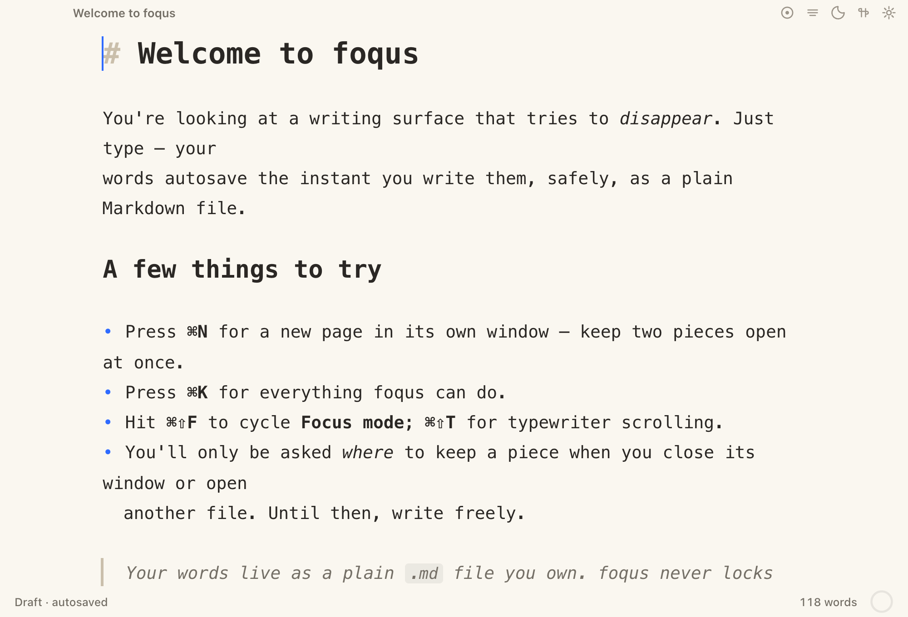
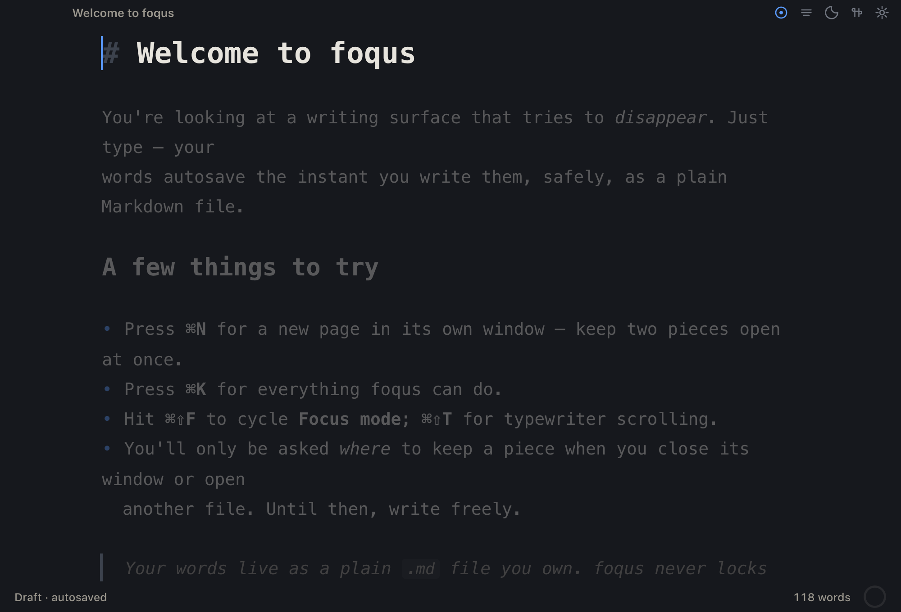
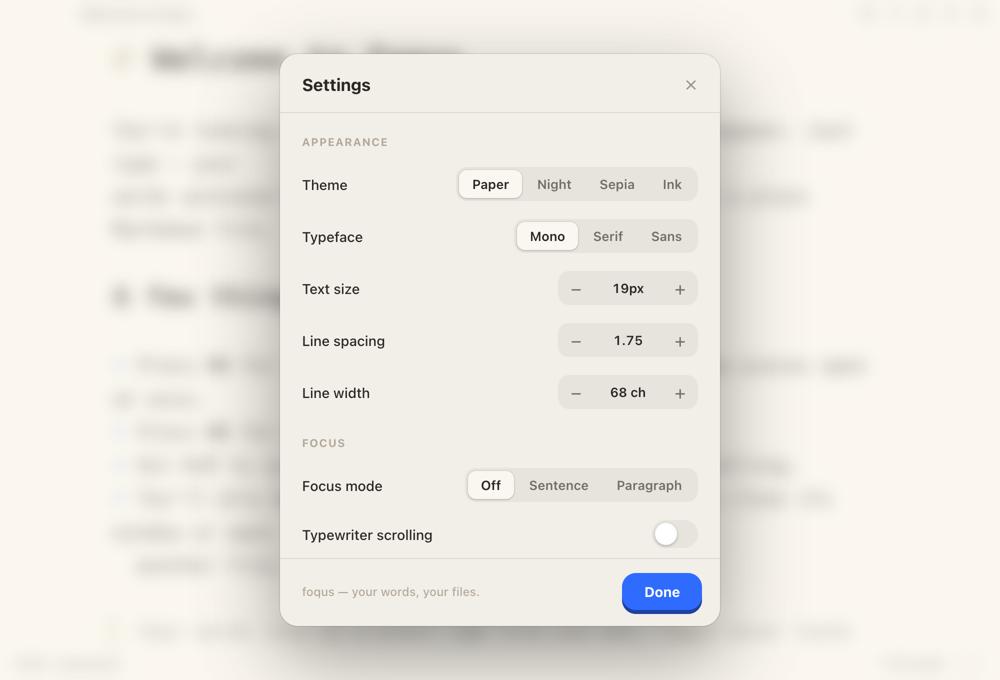
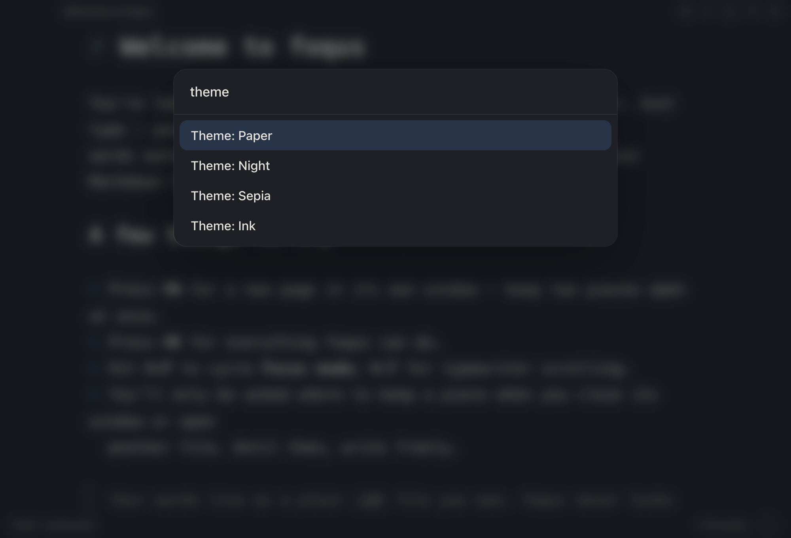
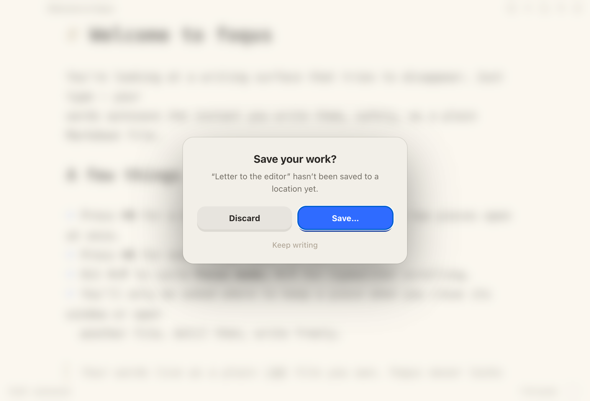

# foqus

A calm, tactile, distraction-free Markdown writing app for macOS — built with **Rust + Tauri**.
It tries to disappear: just type, and your words take the stage.



## Features

- **Live Markdown** — headings grow and **bold** / *italic* / `code` / links format as you type. The Markdown punctuation dims to a whisper and hides itself on every line except the one your cursor is on.
- **Focus mode** — fade everything but the sentence (or paragraph) you're shaping. `⌘⇧F`
- **Typewriter scrolling** — your current line holds at the center of the screen. `⌘⇧T`
- **Themes & type** — four themes (Paper · Night · Sepia · Ink) and three typefaces (Mono · Serif · Sans), with adjustable text size, line spacing, and line width.
- **Command palette** — every action, one keystroke away. `⌘K`
- **Continuous autosave** — your words are saved the instant you write them. A new piece autosaves to a safe draft; you're only asked *where* to keep it when you close the window or open another file.
- **Multi-window** — `⌘N` opens a new page in its own window, so you can work on two pieces at once.
- **Your words, your files** — everything is a plain `.md` file on disk with atomic, crash-safe saves. No account, no lock-in, no telemetry.
- **Quiet momentum** — an optional daily word-goal ring and a gentle, forgiving writing streak.
- **Tactile feel** — pressable buttons, springy controls, and optional typing/UI sound (off by default). Respects "reduce motion".

## Screenshots

| Focus mode (Night) | Settings |
| --- | --- |
|  |  |

| Command palette | Save your work |
| --- | --- |
|  |  |

## Keyboard

| | |
| --- | --- |
| `⌘K` command palette · `⌘,` settings | `⌘N` new window · `⌘O` open · `⌘S` save · `⌘⇧S` save as |
| `⌘⇧F` cycle focus mode | `⌘⇧T` typewriter · `⌘⇧L` cycle theme · `⌘W` close · `⌘Q` quit |

## Tech stack

- **Rust + [Tauri](https://tauri.app) v2** — a native webview shell (small footprint, fast launch). Rust handles file I/O, the native menu, and multi-window.
- **TypeScript + [Vite](https://vitejs.dev)** — no UI framework; a small hand-rolled spring helper and a Web-Audio sound engine keep it lean.
- **[CodeMirror 6](https://codemirror.net)** — the editor core (live Markdown, focus, and typewriter modes).

## Getting started

You'll need **Rust** (via [rustup](https://rustup.rs)) and **Node 18+**.

```bash
npm install
npm run tauri dev      # run the app (hot-reloads)
npm run tauri build    # build a release .app / .dmg
```

## Contributing

foqus is young, and I'd genuinely love your input. Spotted a bug, want a feature, or have a
thought on how something *feels*? **Open an issue or a pull request** — suggestions and
contributions of any size are very welcome.
