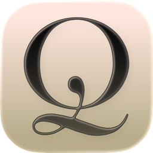

<p align="center">
  
</p>

<h1 align="center">foqus</h1>

<p align="center"><em>a calm place to write.</em></p>

<p align="center">
  <a href="https://github.com/LumHum/foqus/releases/latest"></a>
  
  <a href="LICENSE"></a>
</p>

---

Most writing apps want your attention. **foqus** wants to give it back.

It's a distraction-free Markdown editor that tries, quietly, to disappear — so the
only thing left on screen is the sentence you're shaping. The chrome fades while
you type. Your words are saved the instant you write them. And every control you
*do* touch has a little weight to it, because writing should feel good in the
hands, not just look good on the page.

<p align="center">
  
</p>

## Why foqus

- **It gets out of the way.** No toolbars shouting, no panels jostling for room. Just a page, beautifully set, and a cursor.
- **It's tactile.** Buttons press in, toggles spring, the page turns calm when you ask it to. Small things, done with care.
- **Your words stay yours.** Everything is a plain `.md` file on your disk — no account, no lock-in, no telemetry. Open it in anything, forever.
- **It never loses your work.** Autosave runs as you type; every save keeps a recoverable version you can return to.

## Features

- **Live Markdown** — headings grow and **bold**/*italic*/`code`/links format as you write; the markup dims to a whisper and hides itself on lines you're not editing.
- **Focus mode** — fade everything but the sentence (or paragraph) you're in. `⌘⇧F`
- **Typewriter scrolling** — your current line holds at the center. `⌘⇧T`
- **foqus notebook** — keep all your writing in one folder, organised into subfolders, browsable in a quiet sidebar.
- **Version history** — a visual diff of every save, with one-click restore. `⌘⇧H`
- **Themes & type** — four themes (Paper · Night · Sepia · Ink) and three typefaces, with adjustable size, line-spacing, and line-width.
- **Command palette** — everything, one keystroke away. `⌘K`
- **A new window per piece** — work on two things at once. `⌘N`
- Optional typing & UI sound, a gentle daily word-goal, and a forgiving streak. Respects "reduce motion".

## Download

Grab the latest build from **[Releases »](https://github.com/LumHum/foqus/releases/latest)**

| Platform | File |
| --- | --- |
| **macOS** | `foqus_x.y.z_universal.dmg` — open it and drag foqus to Applications |
| **Windows** | `foqus_x.y.z_x64-setup.exe` — the installer walks you through it |
| **Linux** | `.AppImage` (run it) or `.deb` (`sudo dpkg -i`) |

> foqus is open-source and unsigned, so your OS may ask you to confirm the first
> launch. On macOS: right-click → Open. On Windows: *More info → Run anyway*.

## Screenshots

| Focus mode · Night | Settings |
| --- | --- |
|  |  |

| Version history | Command palette |
| --- | --- |
|  |  |

## Built with

[**Rust**](https://www.rust-lang.org) + [**Tauri**](https://tauri.app) for a small, fast, native shell ·
[**CodeMirror 6**](https://codemirror.net) for the editor ·
**TypeScript** + [**Vite**](https://vitejs.dev), no UI framework — just a little hand-rolled motion and a touch of Web Audio.

## Build from source

You'll need **Rust** (via [rustup](https://rustup.rs)) and **Node 18+**.

```bash
npm install
npm run tauri dev      # run it (hot-reloads)
npm run tauri build    # build installers for your platform
```

## Contributing

foqus is young, and I'd genuinely love your input. Found a bug, have a feature in
mind, or a thought on how something *feels*? **Open an issue or a pull request** —
suggestions and contributions of any size are very welcome.[^1]

## License

[MIT](LICENSE) © Lum Humolli

[^1]: If you make it all the way down here, you're exactly the kind of person foqus is for. Hi. 👋
